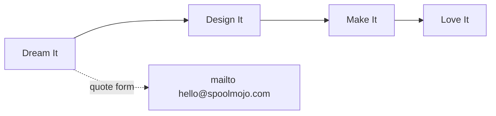

# SpoolMojo

<p align="center">
  
  
  
</p>

<p align="center">
  <strong>If you can dream it, we can print it.</strong><br/>
  Custom 3D-printed gifts, décor, toys, mounts, spare parts, and prototypes — designed, printed, and finished by hand.
</p>

<p align="center">
  <a href="./spoolmojo.html"><b>➜ Open the site</b></a>
  ·
  <a href="#quick-start">Quick start</a>
  ·
  <a href="#whats-inside">What's inside</a>
  ·
  <a href="#review-notes">Review notes</a>
</p>

---

## Brand palette

| | Color | Hex | Role |
|---|---|---|---|
| 🟥 | Coral | `#FF5E5B` | Primary CTA, brand accent |
| 🩵 | Teal | `#00CECB` | Secondary button, accents |
| 💛 | Yellow | `#FFED66` | Kicker / highlight |
| 💜 | Purple | `#7B61FF` | Accent / rim light |
| 🖤 | Ink | `#241E3D` | Text, borders, process band |
| 🍦 | Cream | `#FFF8F0` | Page background |

Filament swatches on the hero also include green `#06D6A0`.

---

## Quick start

No build step. One file, open it.

<details open>
<summary><b>Local preview</b></summary>

```bash
# from the repo root
open spoolmojo.html          # macOS
# or: xdg-open spoolmojo.html
# or: start spoolmojo.html
```

Or serve it (needed if a browser blocks CDN scripts on `file://`):

```bash
python3 -m http.server 8080
# then visit http://localhost:8080/spoolmojo.html
```

</details>

<details>
<summary><b>Deploy (any static host)</b></summary>

Upload `spoolmojo.html` as the site entry (rename to `index.html` if you want `/` to load it).

Works on GitHub Pages, Netlify, Cloudflare Pages, Vercel, S3 — anything that serves static HTML.

Three.js loads from cdnjs; the host only needs to serve the HTML file.

</details>

<details>
<summary><b>Try the quote flow</b></summary>

1. Scroll to **Let's Make Something** (or click **Get a Quote**).
2. Fill name, email, project type, quantity, and idea.
3. Submit → your mail app opens with a pre-filled message to `hello@spoolmojo.com`.
4. Success panel appears in-page after submit.

</details>

---

## What's inside

Single-page marketing site for SpoolMojo.

| Section | Anchor | What it does |
|---|---|---|
| Hero | `#top` | Pitch + interactive 3D filament spool (drag to spin, pick color) |
| What We Make | `#make` | 8 product categories (gifts → wild ideas) |
| How It Works | `#process` | Dream → Design → Make → Love |
| Gallery | `#gallery` | Placeholder tiles (“coming soon”) |
| Quote | `#quote` | Form → `mailto:` with encoded body |
| Footer | — | Nav mirrors + `hello@spoolmojo.com` |

### Interactive bits

```text
┌─────────────────────────────────────────────┐
│  Hero                                       │
│  ┌──────────────┐   ┌─────────────────────┐ │
│  │ Copy + CTAs  │   │ Three.js spool      │ │
│  │              │   │ • drag / touch spin │ │
│  │              │   │ • 5 filament colors │ │
│  │              │   │ • idle momentum     │ │
│  └──────────────┘   └─────────────────────┘ │
└─────────────────────────────────────────────┘
         │
         ▼ scroll reveal (IntersectionObserver)
┌─────────────────────────────────────────────┐
│  Products · Process · Gallery · Quote form  │
└─────────────────────────────────────────────┘
```

### How it works (customer journey)



1. **Dream It** — sketch, photo, link, or words  
2. **Design It** — 3D model + preview tweaks  
3. **Make It** — print, color/material choice, hand finish  
4. **Love It** — pack, ship, happiness guaranteed  

---

## Tech snapshot

| Piece | Detail |
|---|---|
| Markup | One self-contained `spoolmojo.html` |
| Fonts | [Baloo 2](https://fonts.google.com/specimen/Baloo+2) + [Nunito](https://fonts.google.com/specimen/Nunito) via Google Fonts |
| 3D | [Three.js r128](https://cdnjs.cloudflare.com/ajax/libs/three.js/r128/three.min.js) (cdnjs) |
| Motion | CSS float blobs, card hover tilt, scroll `.reveal` |
| Form | Client-only `mailto:` — no backend |
| Contact | `hello@spoolmojo.com` (footer + form action) |

<details>
<summary><b>Spool scene (what the canvas draws)</b></summary>

- Dark flanges + cream hub rings  
- Layered torus “filament windings”  
- TubeGeometry loose filament tail  
- Ambient + key + purple rim lights  
- Drag inertia: velocity decays while idle spin continues  

Color swatches rewrite `filMat.color` on click (coral, teal, yellow, purple, green).

</details>

---

## Review notes

Quick pass on `spoolmojo.html` as it stands today.

### Strengths

- **Self-contained** — easy to share, host, or fork  
- **Hero interaction** actually sells the brand (filament you can spin and recolor)  
- **Clear IA** — make / process / gallery / quote, sticky CTA  
- **Form UX** — labels, required fields, success state after mailto kickoff  
- **Mobile layout** — hero stacks; form goes single-column under 880px  

### Fix soon

| Priority | Issue | Where |
|---|---|---|
| High | Form note says email goes to `spoolmojo@gmail.com`, but submit uses `hello@spoolmojo.com` | Quote form helper text vs JS |
| Medium | Gallery is empty placeholders — fine for launch, but weak social proof | `#gallery` |
| Medium | Mobile nav hides “What We Make / How It Works / Gallery” — only logo + Get a Quote remain | `@media (max-width: 880px)` |
| Low | Quote form has no server — relies on the visitor’s mail client (blocked or awkward on some phones) | `#quote-form` |
| Low | Three.js from CDN with no local fallback if the network fails | script tag |

### Nice-to-haves

- Real gallery photos once first prints ship  
- Hamburger / drawer for mobile section links  
- `prefers-reduced-motion` to calm blob float + auto-spin  
- Open Graph / favicon meta for link previews  
- Align public email everywhere to one address  

---

## Project layout

```text
spoolmojo/
├── spoolmojo.html   # the whole site
└── README.md        # you are here
```

---

## Customize

<details>
<summary><b>Change brand colors</b></summary>

Edit the `:root` block at the top of `spoolmojo.html`:

```css
:root {
  --coral: #FF5E5B;
  --teal: #00CECB;
  --yellow: #FFED66;
  --purple: #7B61FF;
  --ink: #241E3D;
  --cream: #FFF8F0;
}
```

Also update swatch `data-c` / `style` values if filament presets should match.

</details>

<details>
<summary><b>Point the form elsewhere</b></summary>

In the submit handler, change the `mailto:` target (and the form note text so they match):

```js
window.location.href = `mailto:hello@spoolmojo.com?subject=...&body=...`;
```

For a real inbox workflow later: Formspree, Basin, or a tiny serverless function.

</details>

<details>
<summary><b>Add gallery images</b></summary>

Replace each `.g-tile` placeholder with something like:

```html

```

Then restyle `.g-tile` from dashed empty state to `object-fit: cover` photos.

</details>

---

## License / contact

© 2026 SpoolMojo · [spoolmojo.com](https://spoolmojo.com) · Ideas welcome at **hello@spoolmojo.com**

<p align="center">
  <a href="./spoolmojo.html"><b>Open SpoolMojo →</b></a>
</p>
