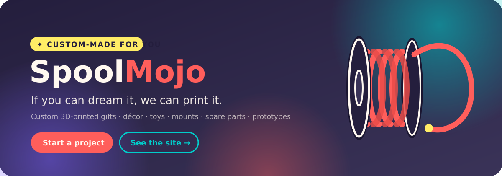
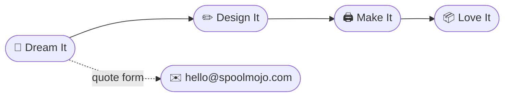

<div align="center">

<a href="https://spoolmojo.com"></a>

<br/><br/>


<br/><br/>

**[🖨️ What We Make](#️-what-we-make)** &nbsp;·&nbsp;
**[🔄 How It Works](#-how-it-works)** &nbsp;·&nbsp;
**[🎨 Brand Kit](#-brand-kit)** &nbsp;·&nbsp;
**[🚀 Run & Deploy](#-run--deploy)** &nbsp;·&nbsp;
**[🛠️ Customize](#️-customize)**


</div>

## 🖨️ What We Make

<table align="center">
  <tr>
    <td align="center" width="25%">🎁<br/><b>Personalized Gifts</b><br/><sub>keepsakes nobody else can give</sub></td>
    <td align="center" width="25%">🏠<br/><b>Home Décor</b><br/><sub>planters, lamps, wall art</sub></td>
    <td align="center" width="25%">🧸<br/><b>Toys & Games</b><br/><sub>articulated critters & puzzles</sub></td>
    <td align="center" width="25%">💻<br/><b>Desk Accessories</b><br/><sub>organizers that tame chaos</sub></td>
  </tr>
  <tr>
    <td align="center">📱<br/><b>Holders & Mounts</b><br/><sub>custom-fit to your gear</sub></td>
    <td align="center">🔧<br/><b>Spare Parts</b><br/><sub>discontinued? we reprint it</sub></td>
    <td align="center">🚀<br/><b>Prototypes</b><br/><sub>sketch → sample, fast</sub></td>
    <td align="center">🎨<br/><b>Your Wild Idea</b><br/><sub>we love a challenge</sub></td>
  </tr>
</table>

<div align="center"></div>

## 🔄 How It Works

<div align="center">

| &nbsp;&nbsp;1️⃣&nbsp;&nbsp; | &nbsp;&nbsp;2️⃣&nbsp;&nbsp; | &nbsp;&nbsp;3️⃣&nbsp;&nbsp; | &nbsp;&nbsp;4️⃣&nbsp;&nbsp; |
|:---:|:---:|:---:|:---:|
| **Dream It** | **Design It** | **Make It** | **Love It** |
| sketch, photo, or just words | 3D model + preview tweaks | printed & hand-finished | packed & shipped to you |

</div>



<div align="center"></div>

## 🎨 Brand Kit

<div align="center">

| Swatch | Name | Hex | Role |
|:---:|---|---|---|
|  | Coral | `#FF5E5B` | Primary CTA, brand accent |
|  | Teal | `#00CECB` | Secondary buttons |
|  | Yellow | `#FFED66` | Kicker / highlights |
|  | Purple | `#7B61FF` | Accents, rim light |
|  | Ink | `#241E3D` | Text, borders, dark band |
|  | Cream | `#FFF8F0` | Page background |

**Fonts:** [Baloo 2](https://fonts.google.com/specimen/Baloo+2) (headings) · [Nunito](https://fonts.google.com/specimen/Nunito) (body)

</div>

<div align="center"></div>

## 🚀 Run & Deploy

One self-contained file. No build step, no dependencies to install.

```bash
open index.html                 # macOS — just open it
python3 -m http.server 8080     # or serve it → http://localhost:8080
```

<details>
<summary><b>🌍 Deploy to spoolmojo.com</b></summary>
<br/>

Any static host works — the site is a single `index.html` (Three.js loads from cdnjs):

1. Push this repo to GitHub → enable **Pages**, or drag the folder into **Netlify** / **Cloudflare Pages** / **Vercel**.
2. Point the `spoolmojo.com` DNS at the host.
3. Done. There is nothing else.

</details>

<details>
<summary><b>✉️ How the quote form works</b></summary>
<br/>

Client-side only: submit opens the visitor's mail app via `mailto:` with the project details pre-filled, addressed to `hello@spoolmojo.com`. No server, no data stored.

Upgrade path when volume grows: point the handler at Formspree / Basin, or a tiny serverless function.

</details>

<details>
<summary><b>🌀 What the 3D hero draws</b></summary>
<br/>

A Three.js filament spool — dark flanges, layered torus windings, a loose filament tail — with drag/touch spin, idle momentum, and five clickable filament colors that recolor the windings live.

</details>

<div align="center"></div>

## 🛠️ Customize

<details>
<summary><b>Change brand colors</b></summary>
<br/>

Edit the `:root` block at the top of `index.html`:

```css
:root{
  --coral:#FF5E5B; --teal:#00CECB; --yellow:#FFED66;
  --purple:#7B61FF; --ink:#241E3D; --cream:#FFF8F0;
}
```

Update the hero swatch `data-c` values if the filament presets should match.

</details>

<details>
<summary><b>Add gallery photos</b></summary>
<br/>

Replace the placeholder `.g-tile` divs with real prints:

```html

```

and restyle `.g-tile` to `object-fit:cover`.

</details>

<details>
<summary><b>Point the form at a different inbox</b></summary>
<br/>

In the submit handler at the bottom of `index.html`, change the `mailto:` address — and keep the helper text under the button in sync.

</details>

<details>
<summary><b>📋 Launch checklist</b></summary>
<br/>

- [ ] Real gallery photos once first prints ship
- [ ] Favicon + Open Graph tags for link previews
- [ ] Hamburger menu for mobile section links
- [ ] `prefers-reduced-motion` fallback for blobs & auto-spin
- [ ] Form backend (Formspree) when mailto gets limiting

</details>

<br/>

<div align="center">


### Spool<span>**Mojo**</span>

*Custom products & gifts, made with mojo.*

**[spoolmojo.com](https://spoolmojo.com)** · **[hello@spoolmojo.com](mailto:hello@spoolmojo.com)**

<sub>© 2026 SpoolMojo · All ideas welcome</sub>

</div>
